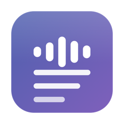
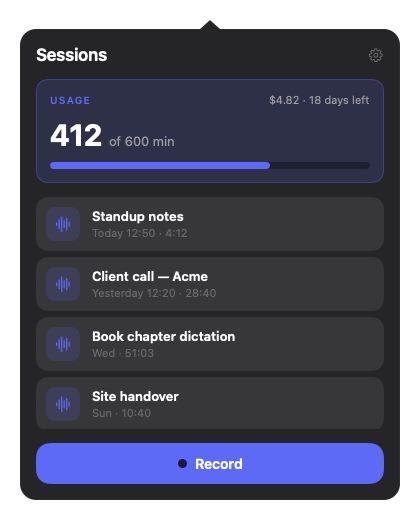
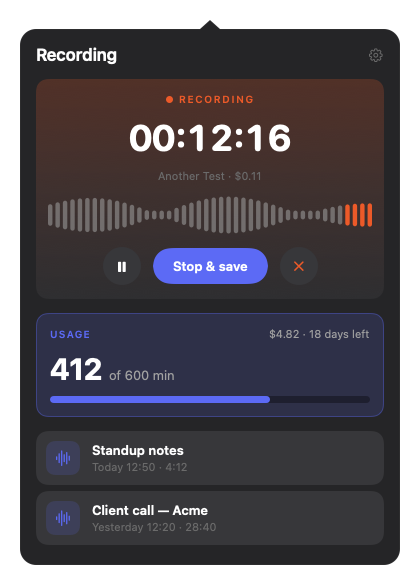
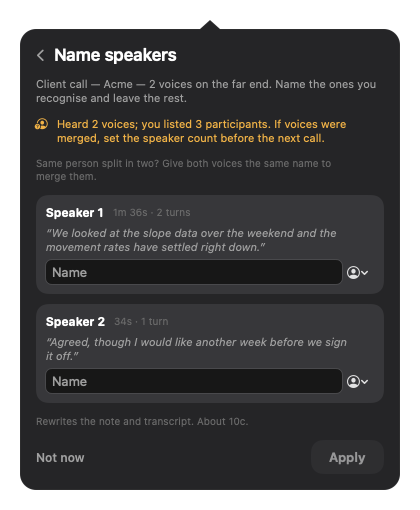
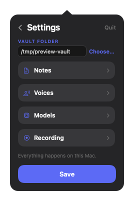
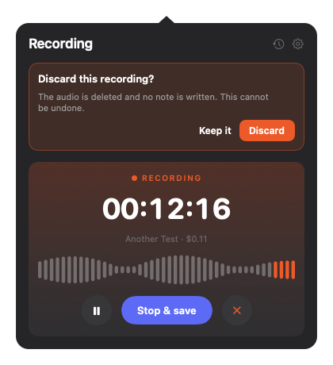
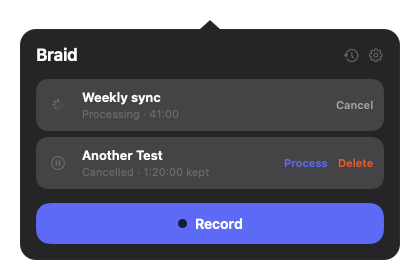

# Braid

Record a meeting. Get notes in your Obsidian vault. That is the whole app.



Two audio tracks, braided into one transcript and one note.

It lives in the macOS menu bar. Click record when a call starts. When the call
ends it stops on its own, and a few minutes later a markdown note appears in your
vault with a summary, the decisions and the action items, alongside the full
transcript.

No bot joins your call. No subscription. Nothing to check afterwards.

## Who this is for

Braid was built for one situation: **a laptop that cannot spare the headroom, and
a handful of meetings a week that actually matter.**

The machine it was written on is an 8 GB M3 MacBook Air. During a Teams call that
machine is already working hard. Teams is an Electron app and not a light one,
and on Apple Silicon the compromises show. Using macOS screen sharing instead of
Teams' own sharing also costs you Teams features that only work through its
native path, Take Control among them. Adding a local transcription model on top
of that is what pushed this toward the cloud, not ideology.

The other half is frequency. If you are in calls all day, a tool that captures
everything gives you an archive nobody reads. Braid assumes the opposite: a few
short meetings a week, where you want the ones that count captured properly and
nothing else. One click to start, automatic stop, note in the vault. Then you get
on with your day.

**It is probably not for you if** you have a machine with headroom to spare and
on-device transcription that never gets in your way. Local models are good now
and cost nothing per hour. If your laptop can carry one without you noticing,
run one.

## How it works

```
menu bar  ──▶  two audio tracks  ──▶  AssemblyAI  ──▶  Claude  ──▶  your vault
              mic + system audio     transcript      summary      note + transcript
                                     + speakers
```

Your microphone and the meeting audio are recorded as **separate tracks**. That
sounds like a detail and is the core design choice: because your voice is on its
own track, you are always labelled correctly, and the speaker separation only has
to work out who is who on the far end.

**Why AssemblyAI.** Transcription and speaker separation happen in one call, with
the speaker labels already attached to the words. Doing it locally would mean
lining up an unlabelled transcript against separately produced speaker segments,
which is fiddly and goes wrong in ways that are hard to see. Accuracy on real
calls is good and diarization adds about two cents an hour, which is what settled
it. The provider sits behind a small protocol, so swapping in another one
(ElevenLabs Scribe, say) is a new adapter, not a rewrite.
[ADR-0002](docs/adr/0002-cloud-diarization-over-local.md)

The summary is a separate Claude call over plain HTTP with no SDK, so pointing it
at a different model or a different provider is a small change in one file.

Everything else is deliberately boring. Recording is crash safe, so pulling the
power costs you a few seconds rather than the meeting. If the network is down when
you stop, the job waits and retries. Nothing is deleted until the note exists on
disk.

**Search comes from Obsidian, not from here.** Braid writes plain markdown with
frontmatter and stops. Indexing, semantic search and asking questions across your
notes are things Obsidian and its plugins already do well.

## Where your audio goes

Braid is not a privacy tool and does not pretend to be. Your recording is
uploaded to **AssemblyAI** for transcription, and the resulting transcript is sent
to **Anthropic** for the summary. Both are third parties operating under their own
terms.

What it does locally: the audio is deleted from your machine once the note is
safely written, and nothing that could identify a voice is stored or reused
between meetings. Those are facts about how it behaves, not a privacy claim.

Recording other people may require their consent where you live, and Braid
announces itself to nobody. That part is on you.

## Costs

Per hour of meeting, at current prices:

| | |
|---|---|
| Transcription with speaker separation | about $0.54 |
| Claude summary | about $0.10 |

Both audio tracks are billed separately, which is what the two-track design costs
you. Providers bill per channel, so mixing them into one file before upload would
halve the transcription line and give up the guaranteed labelling of your own
voice. At a few short meetings a week that is a couple of dollars a month. The
running total, and a monthly budget you set, are shown in the app.

## Using it

Left click the menu bar icon for the **panel**, which hangs off the icon and
points at it. That panel is the whole app: this month's minutes against your
budget, what it has cost, and your recent sessions, each opening its note in
Obsidian. Record expands it into the start form.

While recording, the same panel gains a block at the top with the clock, a live
waveform, pause, stop and discard. Click the icon to tuck it away and the
recording carries on; click again to bring it back.

| idle | recording |
|---|---|
|  |  |

Naming speakers, settings and every confirmation happen in there too, so the app
never opens a second window. Right click the icon for a short menu of shortcuts.

| name speakers | settings | anything irreversible |
|---|---|---|
|  |  |  |

**Recording stops by itself** when your call app releases the microphone, after a
thirty second countdown you can cancel. Starting is always your call. It only
watches once a call app has actually taken the mic, so dictation is never cut
short. The app list is editable in Settings.

Pick a **preset** when you start: Meeting, Lecture, Interview or Training. Each is
a prompt template that shapes the note, and all four are editable.

**Participant names** are hints, never limits. The transcriber works out how many
people are on the call by itself, so someone joining halfway through gets their
own speaker rather than being folded into whoever spoke last. Once the note is
written, Braid offers to **name the speakers** it found, each shown with how long
they talked and a line they said. Naming rewrites the transcript and re-runs the
summary, about ten cents. Nothing is guessed for you.

**Key terms** are the highest value setting in the app. Add proper nouns the
transcriber would not guess, such as product names, sites and colleagues'
surnames, one per line. Keep the list tight, since padding it with common words
makes accuracy worse rather than better.

**Pause** during the private parts of a call. Nothing said while paused is
recorded, and the note marks the gap so the summary does not read two unrelated
halves as one conversation.

Started something by mistake? **Cancel it** while it is processing and it stops
before paying for anything it has not already used. The audio is kept, so you can
send it through after all or delete it deliberately.



## Build it

There is no download. Braid is signed with a local certificate that only this
machine trusts, and shipping a binary without an Apple Developer account means
handing you an app macOS refuses to open. Building it yourself takes a minute.

You need an Apple Silicon Mac on macOS 27, the Swift command line tools (not
Xcode), an [AssemblyAI](https://www.assemblyai.com) key and an
[Anthropic](https://console.anthropic.com) key.

```bash
git clone https://github.com/artraya/braid.git
cd braid

cp .env.example .env          # add your two API keys
./scripts/build-app.sh        # builds dist/Braid.app
cp -R dist/Braid.app /Applications/
./scripts/load-keys.sh        # moves the keys into the Keychain
```

Open the app, click the menu bar icon, and set your vault folder in Settings. On
your first recording macOS asks for Microphone and System Audio Recording.

The build signs with a local identity called `ms-notes Development`, named before
the app was and kept because renaming a signing identity is what makes macOS
forget permissions it has already granted. Create one in Keychain Access, or edit
`scripts/build-app.sh` to use your own. A stable identity matters: without it
macOS treats every rebuild as a brand new app and asks for permissions again.

## Design decisions

**System audio without the Screen Recording permission.** Most apps here use
ScreenCaptureKit, which means granting Screen Recording, a purple indicator in
your menu bar, and a re-approval prompt every month. This uses Core Audio process
taps, which need only the audio-only permission.
[ADR-0001](docs/adr/0001-process-tap-two-track-capture.md)

**No local machine learning.** See above: on a RAM-constrained laptop already
running a video call, that is the difference between usable and not.
[ADR-0002](docs/adr/0002-cloud-diarization-over-local.md)

**Knowing the call ended without watching the call.** Auto-stop reads Core Audio's
per-process state and asks one question: is Teams holding the microphone? No
Accessibility permission, no scraping window titles, nothing that breaks when
Microsoft redesigns the UI.

**No voiceprints.** Voices are grouped within a single call and then forgotten.
Nothing is stored or reused across meetings.
[ADR-0003](docs/adr/0003-no-voiceprints-ever.md)

## Project layout

```
Sources/BraidCore/    capture engine, call watcher, provider adapters, pipeline
Sources/BraidApp/     menu bar app and headless test modes
Sources/BraidApp/UI/  the panel: every view the app has
Tests/                unit tests
scripts/              build, install, icon and key helpers
docs/adr/             why the difficult decisions went the way they did
```

```bash
./scripts/test.sh                              # unit tests
./.build/debug/BraidApp --ui-preview           # every panel view, on screen
./.build/debug/BraidApp --ui-preview --snapshot docs/screenshots
./.build/debug/BraidApp --ui-preview --check-geometry
```

## Status

Working, in daily use, and unlikely to grow much. A personal tool published in
case the approach is useful to someone else. No support offered, but the decision
records should make it easy to take in a different direction.

MIT licensed.
